##

  

[How Do Machines Learn?]{.custom-title}

[... and How Do We Humans Learn?]{.custom-subtitle}

## {background-color="black"}

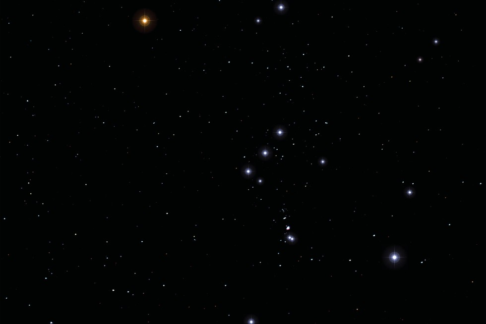{.absolute bottom=25 right=0 height="100%" width="100%"}

<h3>How do we learn?</h3>

## {background-color="black"}

{.absolute bottom=25 right=0 height="100%" width="100%"}

<h3>How do we learn?</h3>

We assemble disordered   information into patterns   that can be more easily recognized

## {background-color="black"}

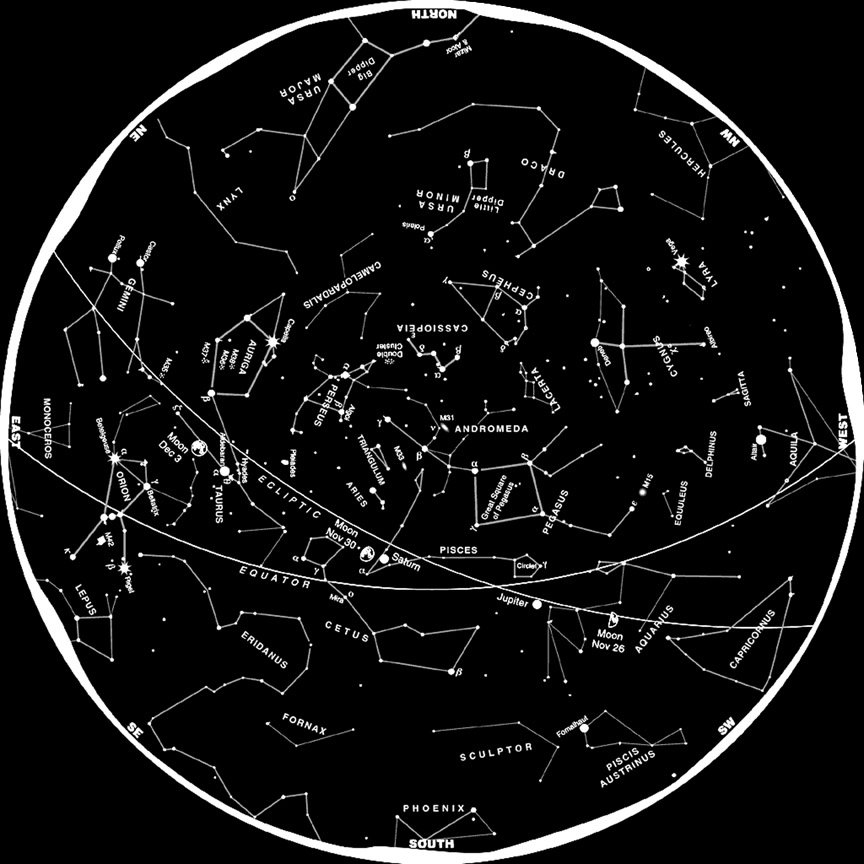{.absolute bottom=100 right=0 height="500" width="500"}

<h3>How do we learn?</h3>

We assemble disordered   information into patterns   that can be more easily recognized

## How do we learn?

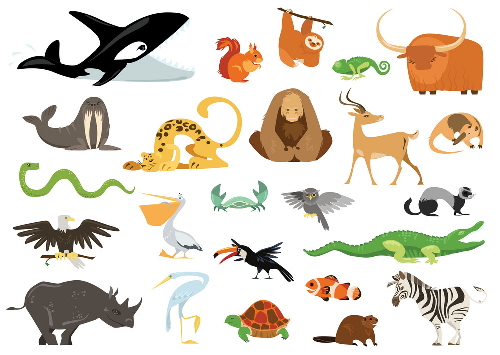{.absolute bottom=100 right=0 height="480" width="670"}
 We group things  into categories based  on observed  characteristics

## How do we learn?

:::{.columns}

::::{.column width="50%"}
We use **prior knowledge** to classify new observations into known categories

 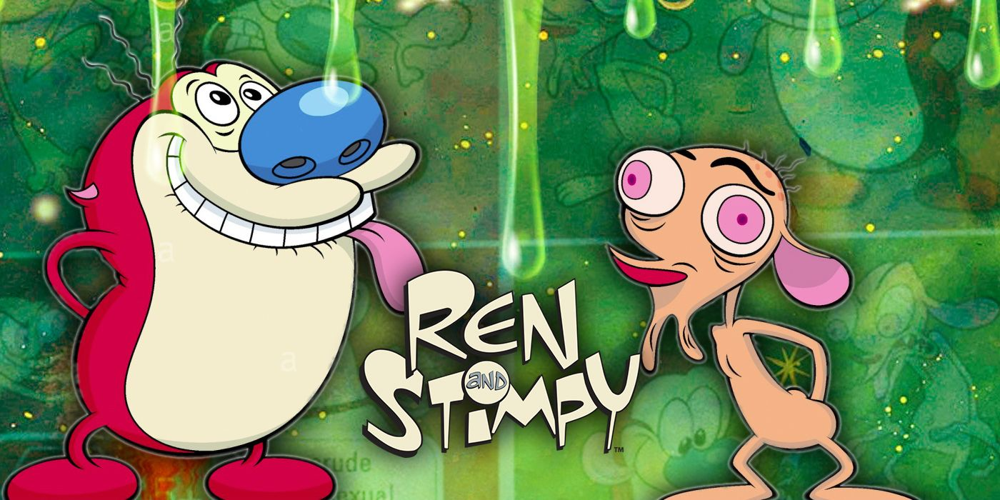
::::

::::{.column width="50%"}
 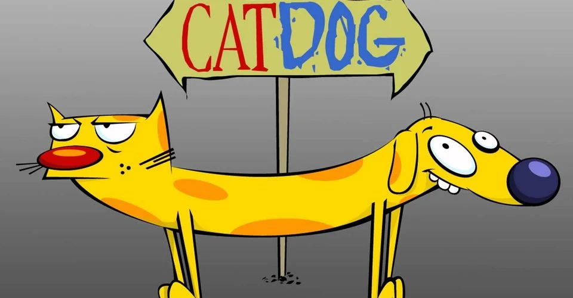
::::

:::

## How do we learn?

:::{.columns}

::::{.column width="50%"}

 
::::

::::{.column width="50%"}
 We make predictions based on **prior knowledge**

We **test** those predictions

We **update our understanding** based on the outcome of the test
::::

:::

## How do we learn?

:::{.columns}

::::{.column width="50%"}

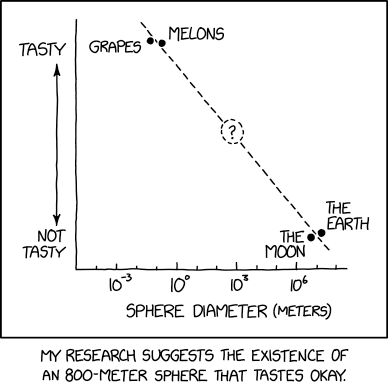{width=100%}
::::

::::{.column width="50%"}
 We make predictions based on **prior knowledge**

We **test** those predictions

We **update our understanding** based on the outcome of the test
::::

:::

## Machine Learning

:::columns

::::{.column width="40%"}
We can use the same ideas to design methods and algorithms for machine learning

* Unsupervised machine learning
* Supervised machine learning
::::

::::{.column width="60%"}

{style="float:right; font-size: 0.75em;"}](images/classical_ml.jpg)
::::

:::

## Unsupervised Machine Learning

* Infer underlying structures within a set of data
* No prior knowledge needed (“unlabeled”)
* E.g., constellations, animal types
* E.g., Principal Component Analysis (PCA), clustering algorithms

## Unsupervised Machine Learning

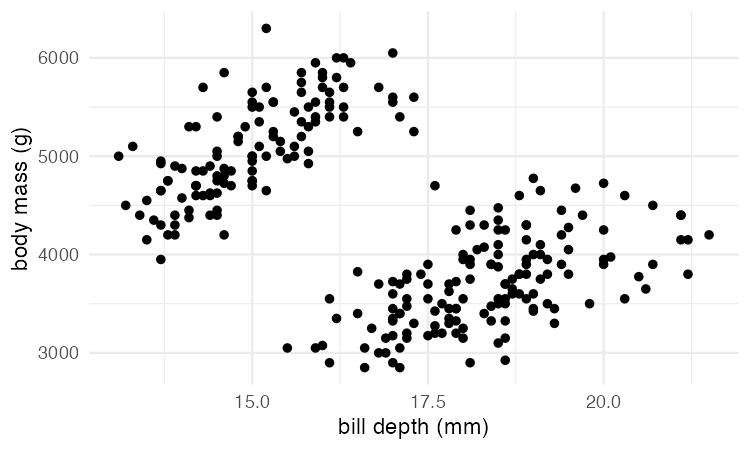{fig-align="center"}

## Unsupervised Machine Learning

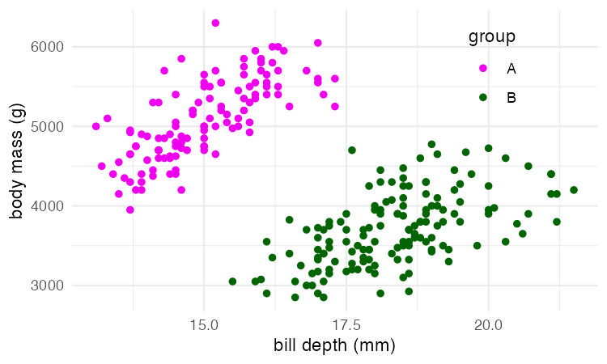{fig-align="center"}

## Unsupervised Machine Learning

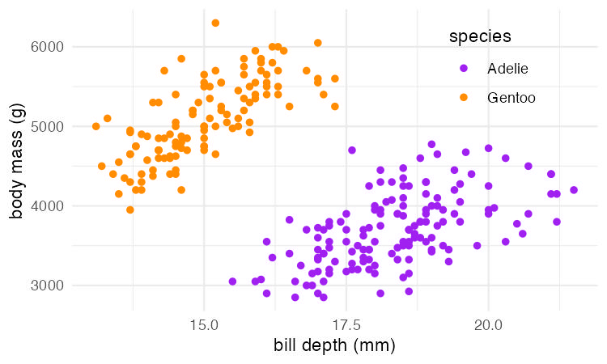{fig-align="center"}

## Supervised Machine Learning

Identify a function that, given input(s), best predicts an output

Requires data linking inputs with **known** outputs (“labeled”), e.g.:

* Predicting the tastiness of a sphere (regression)
* Discerning dogs from cats (classification)
* Catching a ball (classification: caught or not?)

E.g., regression analysis, classification algorithms

## Supervised Machine Learning

:::columns
::::{.column width="45%"}
 Guess why Captcha is always asking you to select images of traffic lights and cars and motorcycles?
::::

::::{.column width="55%"}
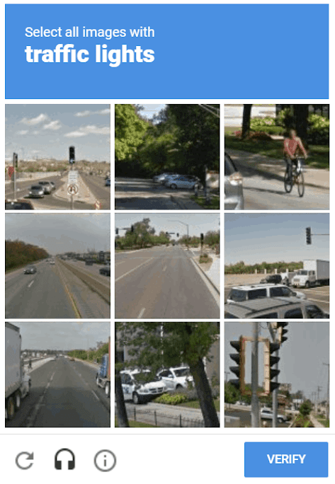{width="70%"}
::::

:::

## Supervised Machine Learning

:::columns

::::{.column width="45%"}
 Guess why Captcha is always asking you to select images of traffic lights and cars?
::::

::::{.column width="55%"}
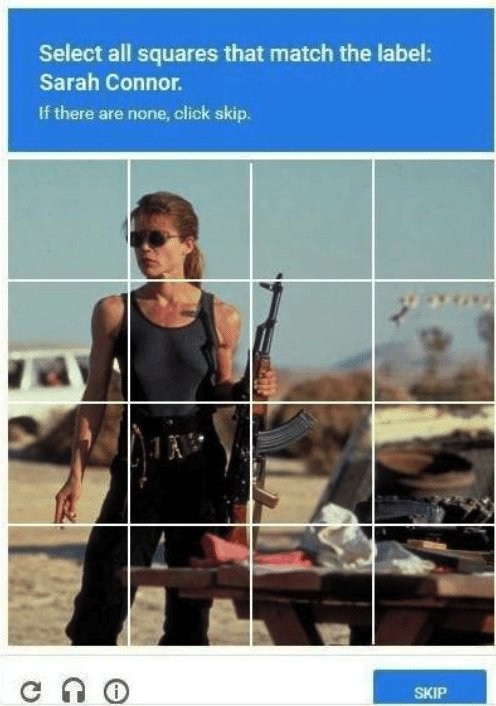{width="70%"}
::::
:::

<!-- ## -->

<!-- Machine learning requires: -->

<!-- * Data (lots of it!) -->
<!-- * Features (aka variables or parameters or predictors) -->
<!-- * Algorithms -->

##

{style="float:right; font-size: 0.75em;"}](images/all_ml.jpg)

##

{style="float:right; font-size: 0.75em;"}](images/classical_ml.jpg)

